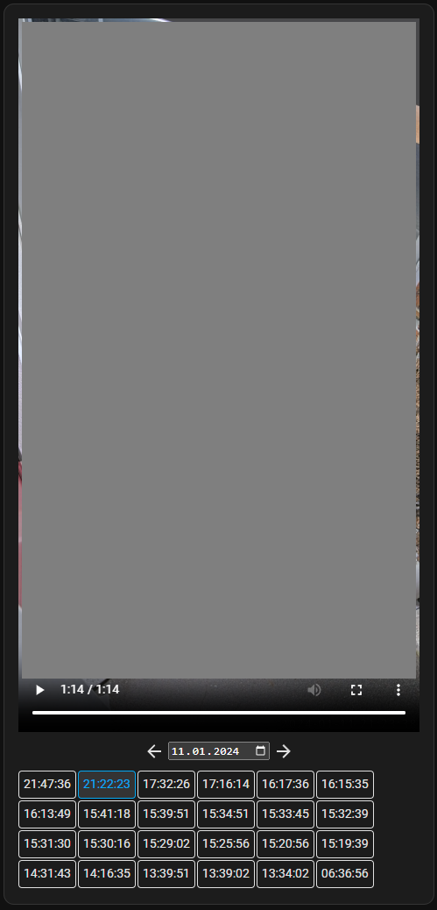

My camera saves its recordings to an SMB share and I have integrated this as a [media source](https://www.home-assistant.io/common-tasks/os/#add-a-new-network-storage) in Home Assistant.  
This card loads all videos from this media source, filters by date and extracts the time stamps from the file names.

**work in progress !**

